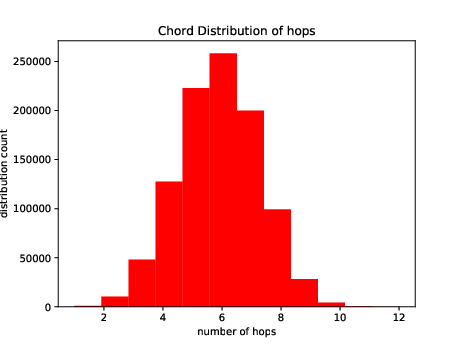

# Chord

Simulated a distributed network, Chord, using Distributed Hash Tables(DHT) that supports -  
1. Looking up for data stored in this distributed environment
2. Addition of new node in network followed by re-distribution of data
3. Deletion of existing node followed by re-distribution of data and stabilisation in network

Evaluated the performance of network using 3 different configurations with number of nodes in the network as 100, 500 and 1000. Each configuration had 10,000 data points stored distributedly.   

For each configuration , following operations were performed -  
1. 1M randon search queries
2. Deleting half of the nodes from the network randomly
3. Adding new nodes

The graph shows the average number of hops taken by a search query to look up the data in a network with 1000 nodes.

